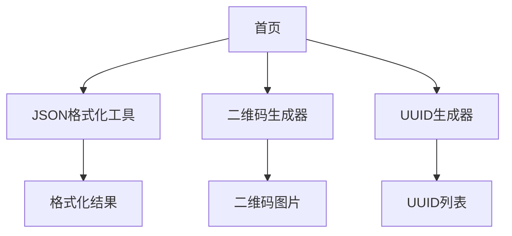

## 1. 产品概述
小工具集合网站是一个提供常用开发工具的平台，包含JSON格式化、二维码生成和UUID生成器。帮助开发者快速处理日常开发中的格式化和生成需求。

目标用户为开发者和技术人员，提供简洁高效的在线工具服务。

## 2. 核心功能

### 2.1 用户角色
本产品为工具类网站，无需用户注册登录，所有用户均可免费使用全部功能。

### 2.2 功能模块
工具网站包含以下主要页面：
1. **首页**：工具导航、功能介绍、使用说明
2. **JSON格式化工具**：JSON格式化、压缩、验证、语法高亮
3. **二维码生成器**：文本转二维码、自定义尺寸、下载功能
4. **UUID生成器**：生成标准UUID、批量生成、格式选择

### 2.3 页面详情

| 页面名称 | 模块名称 | 功能描述 |
|---------|---------|---------|
| 首页 | 导航栏 | 显示网站logo和工具分类导航 |
| 首页 | 工具卡片 | 展示三个核心工具的入口图标和简介 |
| 首页 | 使用说明 | 简要说明各工具的使用方法 |
| JSON格式化 | 输入区域 | 粘贴或输入JSON文本，支持文件上传 |
| JSON格式化 | 格式化按钮 | 将输入的JSON进行格式化排版 |
| JSON格式化 | 压缩按钮 | 将JSON压缩成单行格式 |
| JSON格式化 | 验证功能 | 检查JSON语法是否正确 |
| JSON格式化 | 输出区域 | 显示格式化后的结果，支持语法高亮 |
| JSON格式化 | 复制按钮 | 一键复制格式化后的内容 |
| 二维码生成器 | 输入框 | 输入要生成二维码的文本内容 |
| 二维码生成器 | 尺寸设置 | 选择二维码尺寸大小（小/中/大） |
| 二维码生成器 | 生成按钮 | 实时生成二维码图片 |
| 二维码生成器 | 预览区域 | 显示生成的二维码图片 |
| 二维码生成器 | 下载功能 | 下载二维码为PNG图片 |
| UUID生成器 | 生成按钮 | 生成单个标准UUID |
| UUID生成器 | 批量生成 | 选择数量批量生成多个UUID |
| UUID生成器 | 格式选择 | 选择UUID格式（带横线/不带横线/大写/小写） |
| UUID生成器 | 结果展示 | 显示生成的UUID列表 |
| UUID生成器 | 复制功能 | 复制单个或全部UUID |

## 3. 核心流程

用户访问网站后，可以直接选择需要的工具进行使用：

1. JSON格式化流程：输入JSON文本 → 选择格式化或压缩 → 查看结果 → 复制使用
2. 二维码生成流程：输入文本内容 → 选择尺寸 → 生成二维码 → 预览并下载
3. UUID生成流程：点击生成按钮 → 获取UUID → 选择格式 → 复制使用

## 4. 用户界面设计

### 4.1 设计风格
- **主色调**：蓝色系（#3B82F6）体现技术感
- **辅助色**：灰色系（#6B7280）用于文字和边框
- **按钮样式**：圆角矩形，hover效果，主要按钮使用主色调
- **字体**：系统默认字体，标题16-18px，正文14px
- **布局风格**：卡片式布局，响应式网格系统
- **图标风格**：使用简洁的线性图标

### 4.2 页面设计概览

| 页面名称 | 模块名称 | UI元素 |
|---------|---------|---------|
| 首页 | 导航栏 | 白色背景，蓝色logo，水平导航菜单 |
| 首页 | 工具卡片 | 三列网格布局，每个工具使用卡片展示，包含图标、标题和简介 |
| JSON格式化 | 输入输出区 | 左右分栏布局，代码编辑器样式，语法高亮 |
| JSON格式化 | 操作按钮 | 蓝色主按钮，灰色次要按钮，按钮组水平排列 |
| 二维码生成器 | 输入区 | 顶部输入框，尺寸选择器并排排列 |
| 二维码生成器 | 预览区 | 中央显示二维码，白色背景，下载按钮在下方 |
| UUID生成器 | 控制区 | 顶部按钮组，格式选择下拉菜单 |
| UUID生成器 | 结果区 | 列表形式展示UUID，每项都有复制按钮 |

### 4.3 响应式设计
- 桌面端优先设计，支持1200px以上宽度
- 平板端适配，768px-1199px使用两列布局
- 移动端适配，767px以下使用单列布局
- 触摸交互优化，按钮大小适合手指点击

## 5. 性能要求
- 页面加载时间小于2秒
- 工具响应时间小于500毫秒
- 支持离线使用（PWA）
- 兼容主流浏览器（Chrome, Firefox, Safari, Edge）