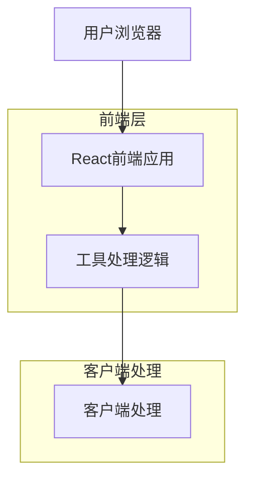
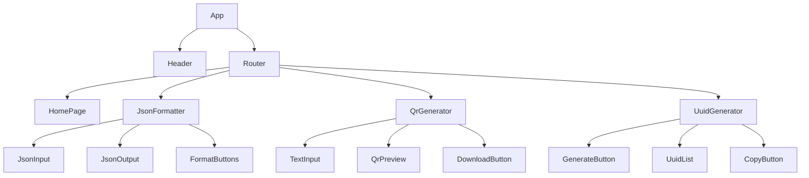

## 1. 架构设计



## 2. 技术描述

- 前端：React@18 + TailwindCSS@3 + Vite
- 初始化工具：vite-init
- 后端：无（纯客户端应用）
- 部署：静态网站托管（Vercel/Netlify）

## 3. 路由定义

| 路由 | 用途 |
|------|------|
| / | 首页，展示工具导航 |
| /json-formatter | JSON格式化工具页面 |
| /qr-generator | 二维码生成器页面 |
| /uuid-generator | UUID生成器页面 |

## 4. 核心依赖

### 4.1 主要依赖包
- `react` - React核心库
- `react-dom` - React DOM渲染
- `react-router-dom` - 路由管理
- `tailwindcss` - CSS框架
- `vite` - 构建工具

### 4.2 工具相关依赖
- `qrcode` - 二维码生成库
- `uuid` - UUID生成库
- `prismjs` - 代码语法高亮
- `react-syntax-highlighter` - React代码高亮组件

## 5. 组件架构



## 6. 工具实现逻辑

### 6.1 JSON格式化工具
- 使用原生JSON.parse()和JSON.stringify()进行格式化和压缩
- 使用try-catch捕获语法错误并提示用户
- 集成Prism.js实现语法高亮显示

### 6.2 二维码生成器
- 使用qrcode库生成二维码图片
- 支持自定义尺寸（128x128, 256x256, 512x512）
- 使用canvas或SVG渲染二维码
- 提供PNG格式下载功能

### 6.3 UUID生成器
- 使用uuid库的v4版本生成标准UUID
- 支持批量生成（1-100个）
- 提供多种格式选项（带横线/不带横线/大小写）
- 使用剪贴板API实现复制功能

## 7. 状态管理

使用React的useState和useEffect进行本地状态管理：
- 工具输入内容状态
- 工具输出结果状态
- 用户设置偏好（如二维码尺寸、UUID格式）
- 错误提示状态

## 8. 性能优化

- 使用React.memo优化组件重渲染
- 实现防抖机制优化输入处理
- 使用Web Workers处理大文件JSON格式化
- 图片懒加载和代码分割

## 9. 浏览器兼容性

- Chrome 80+
- Firefox 75+
- Safari 13+
- Edge 80+
- 支持ES6+语法和CSS Grid/Flexbox

## 10. 部署配置

### 10.1 Vite配置
```javascript
export default {
  base: './',
  build: {
    outDir: 'dist',
    assetsDir: 'assets',
    minify: 'terser',
    sourcemap: false
  }
}
```

### 10.2 Tailwind配置
```javascript
module.exports = {
  content: [
    "./index.html",
    "./src/**/*.{js,ts,jsx,tsx}",
  ],
  theme: {
    extend: {},
  },
  plugins: [],
}
```